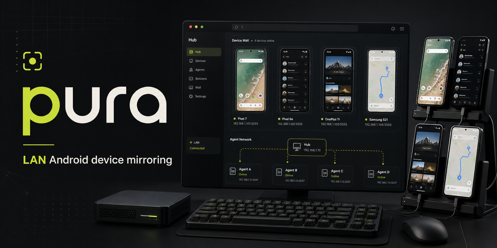

# pura



pura is a LAN Android device mirror for product and design teams. A central Hub shows all online Android devices, while each developer runs a local Agent that talks to their own USB-connected phone through ADB. Agents keep outbound connections to the Hub, so the Hub can run inside Docker without reaching back into developer laptops.

No login, no cloud, no public tunnel. It is meant for trusted office networks.

## Quickstart

Start the Hub with Docker Compose:

```bash
docker compose up -d
```

Open the Hub:

```text
http://<hub-lan-ip>:8787
```

On each developer machine, connect an Agent. After this command starts, the Hub page shows every authorized Android device attached to this machine:

```bash
npx @nickname4th/pura-cli connect <hub-lan-ip>:8787 --name "Zhang San"
```

On macOS, keep the Agent connected after login or terminal close. Install the CLI globally first so the background service has a stable executable path, then connect with `--background`:

```bash
npm install -g @nickname4th/pura-cli
pura-cli connect <hub-lan-ip>:8787 --name "Zhang San" --background
```

Open the Hub page, find the device under devices to publish, and publish it from the web UI. Designers can then pick the published machine on the Hub homepage, open the live screen, and click on it with a mouse.

## Project Site

The GitHub Pages site lives in `site/` and is deployed by `.github/workflows/pages.yml`.

After publishing the repository, enable GitHub Pages with GitHub Actions as the source. The public URL will be:

```text
https://liutianjie.github.io/pura/
```

## Requirements

- Node.js 20+ for developer Agents
- Android platform-tools: `adb`
- Android USB debugging enabled and authorized on each developer machine
- Docker and Docker Compose for Hub deployment
- Hub is reachable from developer machines over the LAN
- A modern browser

## Installation

Developers can use pura without installing it permanently:

```bash
npx @nickname4th/pura-cli --help
```

Or install globally:

```bash
npm install -g @nickname4th/pura-cli
pura-cli --help
```

For repository development:

```bash
npm install
npm run build
npm link
```

## Hub Deployment

Recommended Docker Compose deployment:

```bash
docker compose up -d
```

The compose file mounts a `pura-data` volume at `/data`. Hub-side screenshots and per-device discussion document bindings are stored there, so keep this volume when upgrading.

The included compose file builds the local image by default. To use a published GHCR image:

```bash
PURA_IMAGE=ghcr.io/liutianjie/pura:main docker compose up -d
```

Equivalent Node.js deployment:

```bash
DATA_DIR=data-hub pura-cli hub --host 0.0.0.0 --port 8787
```

### Feishu / Lark Discussion Documents

Pura can bind one Feishu/Lark Docx discussion document per device. Enable this feature only when your team needs it. In the control sidebar, paste an existing document URL or create a new document, then use the screenshot action to append the time, device name, optional note, and screenshot to the document. The bound document can also be opened in a right-side drawer with an editable URL bar.

Configure these environment variables on the Hub:

```bash
PURA_FEATURE_LARK_DOCS=true
LARK_APP_ID=cli_xxx
LARK_APP_SECRET=xxx
```

`LARK_DOC_FOLDER_TOKEN` is optional. When set, it becomes the default folder for quick-created documents. Without it, quick-created documents are created in the app's default location.

When `PURA_FEATURE_LARK_DOCS` is not `true`, the web UI hides all Feishu/Lark document controls. If the feature is enabled but app id or secret are missing, the web UI shows "Lark app is not configured" and hides create/write actions.

Required Feishu app permissions include Docx document create/edit and document media upload (`docs:document.media:upload`). Binding Wiki URLs additionally needs Wiki node read permission, such as `wiki:wiki:readonly`, and access to the target Wiki node. Give the app access to the target folder, Wiki node, or document before using quick-create or screenshot insertion.

## Developer Agent

Each developer connects their local Agent to the Hub. Once connected, the Hub web UI lists all authorized local Android devices, including devices that are not published yet:

```bash
pura-cli connect 192.168.100.128:8787 --name "Zhang San"
```

The Agent keeps an outbound control WebSocket to the Hub and continuously reports local ADB devices. Use the web UI to publish, rename, unpublish, and manage devices.

The control view includes:

- shared viewer presence and optional shared cursors
- screen annotations with saved screenshot overlays
- filtered `adb logcat` views for current app, crashes, network, or all logs
- Hub-stored APK upload and install
- deeplink launch from the browser

The Agent still exposes `8788` locally for diagnostics and standalone mode, but the Hub no longer depends on reverse HTTP access to that port. In normal Hub deployments, you should not need `--public-url`.

For diagnostics, you can still override the announced local URL:

```bash
pura-cli connect 192.168.100.128:8787 --name "Zhang San" --public-url http://192.168.100.45:8788
```

The Agent heartbeat automatically recovers after Wi-Fi or Hub restarts as long as the Agent process is still running. On macOS, install the saved Agent connection as a LaunchAgent so it starts at login and restarts if the terminal is closed:

```bash
pura-cli connect 192.168.100.128:8787 --name "Zhang San" --background
```

Check or remove the background service:

```bash
pura-cli auto-connect --status
pura-cli auto-connect --uninstall
```

## Publish Device

Connect a phone over USB and confirm it is authorized:

```bash
adb devices -l
```

Then run or install the Agent:

```bash
pura-cli connect 192.168.100.128:8787 --name "Zhang San" --background
```

Open the Hub page and publish the device from the web UI.

The CLI also has a shortcut for scripts:

```bash
pura-cli connect device --name "Zhang San Pixel 8" --owner "Zhang San" --note "login branch"
```

If multiple Android devices are connected:

```bash
pura-cli connect device --serial RFCY10DHQ3P --name "Samsung S25" --owner "Li Si"
```

## Runtime Model

- Hub maintains online Agents and devices, serves the web UI, and proxies video WebSocket/tap requests.
- Agent runs on each developer machine and owns ADB, screen capture, tap execution, and device metadata.
- Agent opens outbound control/video WebSockets to the Hub. The Hub does not need to call back into Agent LAN addresses, which makes Docker/NAT/firewall deployment much more reliable.
- CLI commands:
  - `pura-cli hub`
  - `pura-cli connect <hub>`
  - `pura-cli auto-connect`
  - `pura-cli connect device`
  - `pura-cli devices`

## API

Hub:

- `POST /api/agents/heartbeat`
- `GET /api/devices`
- `POST /api/devices/:deviceId/session`
- `POST /api/devices/:deviceId/tap`
- `POST /api/devices/:deviceId/logs`
- `POST /api/devices/:deviceId/deeplink`
- `POST /api/devices/:deviceId/packages/:packageId/install`
- `GET /api/packages`
- `POST /api/packages`
- `PUT /api/devices/:deviceId/publication`
- `DELETE /api/devices/:deviceId/publication`
- `POST /api/devices/:deviceId/screenshots`
- `PUT /api/devices/:deviceId/screenshots/:screenshotId/annotated`
- `GET /api/devices/:deviceId/discussion-doc`
- `PUT /api/devices/:deviceId/discussion-doc`
- `POST /api/devices/:deviceId/discussion-doc`
- `POST /api/devices/:deviceId/screenshots/:screenshotId/discussion-doc`
- `DELETE /api/sessions/:id`
- `WS /ws/sessions/:id/video`
- `WS /ws/agents/:agentId/control`
- `WS /ws/agents/:agentId/sessions/:agentSessionId/video`

Agent:

- `GET /api/devices`
- `POST /api/devices/:serial/session`
- `POST /api/devices/:serial/tap`
- `POST /api/devices/:serial/logs`
- `POST /api/devices/:serial/deeplink`
- `POST /api/devices/:serial/packages/:packageId/install`
- `PUT /api/devices/:serial/publication`
- `DELETE /api/devices/:serial/publication`
- `DELETE /api/sessions/:id`
- `WS /ws/sessions/:id/video`

## Environment

- `ROLE=hub|agent|standalone`
- `HOST=0.0.0.0`
- `PORT=8787`
- `HUB_URL=http://<hub-ip>:8787`
- `AGENT_ID`
- `AGENT_NAME`
- `PUBLIC_URL=http://<agent-ip>:8788` optional diagnostic URL; Hub control does not depend on it
- `ADB_PATH=adb`
- `STREAM_SIZE` optional; unset uses native device resolution
- `STREAM_BITRATE=8000000`
- `STREAM_TIME_LIMIT_SECONDS=180`
- `INCLUDE_TCP_DEVICES=true`
- `DATA_DIR=data-agent`
- `PURA_FEATURE_LARK_DOCS=true` optional feature gate for Feishu/Lark discussion docs; default off
- `LARK_APP_ID`, `LARK_APP_SECRET` optional Hub-only Feishu/Lark Docx integration
- `LARK_DOC_FOLDER_TOKEN` optional default folder for quick-created discussion docs
- `LARK_OPEN_BASE_URL=https://open.feishu.cn` optional override
- `LARK_DOC_BASE_URL=https://www.feishu.cn` optional generated document link base

## Publishing

The npm package is `@nickname4th/pura-cli` and installs the `pura-cli` binary.

Release flow:

1. Update `version` in `package.json`.
2. Run `npm run check`, `npm run build`, and `npm pack --dry-run`.
3. Publish manually with `npm publish --access public`, or push a tag like `v0.1.3` to use the release workflow.
4. The Docker workflow publishes `ghcr.io/liutianjie/pura:main` from `main` and builds both `linux/amd64` and `linux/arm64`.

The release workflow requires an `NPM_TOKEN` repository secret.

## Notes

- The current video path uses Android `screenrecord` H.264 output. No Android app or root is required.
- Mouse control supports tap, long press, scroll/swipe, system keys, text input, screenshots, and shared cursor annotations.
- Do not expose Hub or Agent ports directly to the public internet.
- Agent Docker is intentionally not the default because local USB/ADB access is much smoother with native `pura-cli`.
- Some Android builds enforce `screenrecord` time limits; the Agent restarts the stream automatically when it exits.
