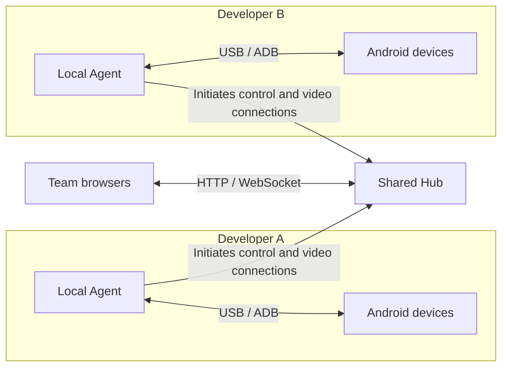

<h1 align="center">pura</h1>

<p align="center">
  <strong>Your team's Android devices. One shared workspace.</strong><br />
  Mirror, control, and review real devices from a browser on your local network.
</p>

<p align="center">
  <a href="https://www.npmjs.com/package/@nickname4th/pura-cli"></a>
  <a href="package.json"></a>
  <a href="LICENSE"></a>
</p>

<p align="center">
  <a href="https://liutianjie.github.io/pura/">Website</a> ·
  <a href="#quick-start">Quick start</a> ·
  <a href="#how-it-works">Architecture</a> ·
  <a href="CONTRIBUTING.md">Contributing</a> ·
  <a href="README.zh-CN.md">简体中文</a>
</p>

<p align="center">
  <br />
  <sub>Product illustration of the Hub-and-Agent workflow.</sub>
</p>

pura brings the phones on your teammates' desks into a shared browser workspace. Developers keep devices attached to their own computers; product, design, and QA can open the Hub, inspect the live screen, reproduce an interaction, and capture feedback together.

A lightweight **Agent** owns the local ADB connection. A central **Hub** serves the interface and relays video and commands over connections initiated by the Agents. The Hub can run in Docker without opening a connection back to each developer laptop.

> **Built for trusted LANs.** Hub and Agent APIs are unauthenticated by default. Anyone who can reach them may be able to view and control connected devices. Keep both behind a trusted network boundary; publishing a device is a catalogue action, not an authorization rule. [Security model](SECURITY.md).

## From a device to a shared review

| Step | What pura provides |
| --- | --- |
| **Connect** | Discover authorized Android devices through each developer's local ADB installation |
| **Publish** | Give a device a name, owner, and note, then add it to the shared device catalogue |
| **Inspect** | Open its live screen, see other viewers, and share cursors during a review |
| **Interact** | Tap, long-press, swipe, scroll, send system keys, and enter text through ADB |
| **Investigate** | Read filtered logcat snapshots, install an uploaded APK, or open a deeplink |
| **Capture** | Save screenshots with drawing and box annotations, then copy or download them |
| **Discuss** | Optionally attach screenshots and notes to a per-device Feishu/Lark document |

The web interface supports English and Chinese. Core mirroring requires no cloud account, Android companion app, or root access. The optional document integration contacts Feishu/Lark only when enabled and used.

## Quick start

### 1. Start the Hub

On a machine reachable by your team, with Docker and Docker Compose installed:

```bash
git clone https://github.com/LiuTianjie/pura.git
cd pura
docker compose up -d --build
```

This explicitly builds the checked-out source. Open `http://<hub-lan-ip>:8787` in a modern browser. The Hub does not need USB access to the phones.

<details>
<summary>Use the published image instead</summary>

From the checkout, pull the default `ghcr.io/liutianjie/pura:main` image and start without building locally:

```bash
docker compose pull
docker compose up -d --no-build
```

The `main` image is published for `linux/amd64` and `linux/arm64`. `PURA_IMAGE` overrides the image reference in Compose; use a pinned tag or digest when you need a reproducible deployment.

</details>

### 2. Connect a developer machine

Install **Node.js 20+** and **Android SDK Platform-Tools** on the computer with the phone attached. Enable USB debugging on the phone and approve that computer's debugging key.

Confirm that ADB reports the device as `device`, then connect the Agent:

```bash
adb devices -l
npx @nickname4th/pura-cli connect 192.168.1.10:8787 --name "Alex"
```

Replace `192.168.1.10:8787` with your Hub address. Keep this process running. The Agent reports local devices and opens outbound control and video connections to the Hub.

### 3. Publish and review

Open the Hub, find the connected device in device management, and publish it. Add an owner and a note such as the build or branch under review. Teammates can then open it from the shared catalogue.

Each developer runs their own Agent. Adding another computer follows the same process; the Hub presents their devices together.

## Keep the Agent running on macOS

For a persistent installation, install the CLI globally so the background service has a stable executable path:

```bash
npm install -g @nickname4th/pura-cli
pura-cli connect 192.168.1.10:8787 --name "Alex" --background
```

This installs a macOS LaunchAgent that starts at login and keeps the Agent process running after the terminal closes. Check or remove that service with:

```bash
pura-cli auto-connect --status
pura-cli auto-connect --uninstall
```

Built-in background installation currently supports **macOS only**. On other platforms, keep the foreground process running or manage it with your own process supervisor. Network recovery depends on the host staying awake, the Agent running, and ADB retaining access to the phone.

<details>
<summary>CLI shortcuts for device publishing</summary>

With the local Agent already running:

```bash
pura-cli devices
pura-cli connect device --name "Review phone" --owner "Alex" --note "login branch"
```

Specify a serial when several phones are connected:

```bash
pura-cli connect device --serial YOUR_ADB_SERIAL --name "Review phone" --owner "Alex"
```

`pura-cli auto-connect` reconnects using the saved configuration. `--public-url` overrides the advertised Agent URL for diagnostics; it is not required for normal Hub relay traffic.

</details>

## How it works


```mermaid
flowchart LR
    Browser[Team browsers] <-->|HTTP / WebSocket| Hub[Shared Hub]
    subgraph A[Developer A]
        AgentA[Local Agent] <-->|USB / ADB| PhoneA[Android devices]
    end
    subgraph B[Developer B]
        AgentB[Local Agent] <-->|USB / ADB| PhoneB[Android devices]
    end
    AgentA -->|Initiates control and video connections| Hub
    AgentB -->|Initiates control and video connections| Hub
```

The Agent initiates each connection; once established, the control channel carries requests and responses in both directions. Device video travels **phone → Agent → Hub → browser**, and input travels back through the relay to local ADB.

| Component | Owns |
| --- | --- |
| **Hub** | Device aggregation, browser UI, relayed sessions, saved screenshots, APK uploads, and document bindings |
| **Agent** | Local discovery, device metadata, publication records, video capture, ADB input, and device operations |
| **Browser** | Video playback, viewer presence, shared cursors, annotations, and review controls |

The current capture path uses Android `screenrecord` with raw H.264 over WebSocket; browser playback uses JMuxer. It is video-only. Android capture behavior varies by device, and a restart can interrupt playback when a device's recording time limit is reached. The Agent restarts an exited stream while viewers remain connected.

Text entry uses `adb shell input text`, so supported characters depend on Android's input implementation. iPhone support is a [design proposal](docs/ios-support.md), not a shipped capability.

## Deploy and keep your data

Compose mounts the named **`pura-data`** volume at `/data`. Keep it across upgrades: it stores screenshots, annotated images, uploaded APKs, and per-device document bindings. Device publication records live on the corresponding Agent.

| Location | Contents |
| --- | --- |
| Hub `DATA_DIR` | Screenshot files/indexes, APK files/indexes, and document bindings |
| `~/.pura/config.json` | CLI connection settings and Agent identity |
| `~/.pura/agent-data` | Default persistent data directory for an Agent started through the CLI |
| `~/Library/Logs/pura-agent.log` | macOS background Agent output; errors use `pura-agent.err.log` |

To update a Hub built from source, pull your intended revision and run `docker compose up -d --build`. To update a published image, use `docker compose pull` followed by `docker compose up -d --no-build`. The `main` tag is mutable.

A Hub can also run directly under Node.js:

```bash
npm install -g @nickname4th/pura-cli
DATA_DIR=data-hub pura-cli hub --host 0.0.0.0 --port 8787
```

Useful diagnostics:

```bash
curl http://127.0.0.1:8787/api/health
docker compose logs --tail=100 pura-hub
```

For a missing device, check `adb devices -l` on its owning computer first, then the Agent's process and Hub connection. If inventory is visible but controls are offline, inspect the control channel; inventory alone does not establish a working session.

## Optional Feishu / Lark documents

Bind an existing Docx document to a device or create one from the control sidebar. The screenshot action can append the timestamp, device name, optional note, and saved image. A bound document can also open in the side drawer.

Add the following entries under the Hub service's `environment` in `docker-compose.yml`, with credential values supplied through your shell or a private `.env` file:

```yaml
PURA_FEATURE_LARK_DOCS: "true"
LARK_APP_ID: ${LARK_APP_ID}
LARK_APP_SECRET: ${LARK_APP_SECRET}
```

`LARK_DOC_FOLDER_TOKEN` optionally selects the folder for newly created documents. The app needs document create/edit access and `docs:document.media:upload`; Wiki links additionally require Wiki node read access, such as `wiki:wiki:readonly`. Grant the app access to the target document, folder, or Wiki node.

The feature is **off by default**. Missing credentials disable create/write actions. Credentials stay on the Hub; using the integration sends document content and screenshot media to Feishu/Lark. The saved binding on the Hub is not a local copy of the remote document.

## Configuration

CLI flags cover ordinary setup. Environment variables configure the server runtime:

| Variable | Default / meaning |
| --- | --- |
| `ROLE` | `standalone`; use `hub` or `agent` for a distributed setup |
| `HOST` | `0.0.0.0` |
| `PORT` | Server default `8787`; the CLI starts Agents on `8788` unless overridden |
| `HUB_URL` | Hub address used by an Agent |
| `AGENT_ID`, `AGENT_NAME` | Stable Agent identity and display name |
| `DATA_DIR` | Server default `data`; CLI/Compose set the locations described above |
| `ADB_PATH` | Optional path to the ADB executable |
| `STREAM_SIZE` | Unset: capture at the device's native resolution |
| `STREAM_BITRATE` | `8000000` bits/s |
| `STREAM_TIME_LIMIT_SECONDS` | `180`; subject to the device's `screenrecord` behavior |
| `INCLUDE_TCP_DEVICES` | Set `true` to include already connected ADB-over-TCP devices; USB only by default |
| `PUBLIC_URL` | Optional advertised Agent URL for diagnostics; normal relay traffic does not use it |
| `PURA_FEATURE_LARK_DOCS` | Set `true` to enable document integration |
| `LARK_APP_ID`, `LARK_APP_SECRET` | Hub-side integration credentials |
| `LARK_DOC_FOLDER_TOKEN` | Optional default document folder |
| `LARK_OPEN_BASE_URL` | `https://open.feishu.cn` |
| `LARK_DOC_BASE_URL` | `https://www.feishu.cn`; base for generated document links |

<details>
<summary>API entry points</summary>

Hub routes use a Hub device ID; direct Agent routes use an ADB serial. They are different identifiers.

| Endpoint | Purpose |
| --- | --- |
| `GET /api/health` | Process health and role |
| `GET /api/devices` | Device inventory |
| `POST /api/devices/:deviceId/session` | Create or reuse a mirror session |
| `PUT /api/devices/:deviceId/publication` | Publish or update device metadata |
| `DELETE /api/devices/:deviceId/publication` | Unpublish a device |
| `POST /api/devices/:deviceId/tap` | Send a tap |
| `POST /api/devices/:deviceId/control` | Send a supported key or text action |
| `POST /api/devices/:deviceId/logs` | Read a filtered logcat snapshot |
| `POST /api/devices/:deviceId/deeplink` | Open an Android deeplink |
| `GET /api/packages`, `POST /api/packages` | List or upload APKs |
| `POST /api/devices/:deviceId/packages/:packageId/install` | Install a saved APK on a device |
| `POST /api/devices/:deviceId/screenshots` | Capture and save a screenshot |
| `DELETE /api/sessions/:id` | End a mirror session |
| `WS /ws/sessions/:id/video` | Receive the H.264 stream |

Request bodies and the remaining screenshot, annotation, document, and Agent relay routes are defined in [Hub routes](server/src/hub.ts), [Agent routes](server/src/agent.ts), and [WebSocket dispatch](server/src/index.ts).

</details>

## Development and contributions

The project uses TypeScript, React, Vite, Express, and `ws`. CI builds with Node.js 22.

```bash
npm ci
npm run dev
```

The development UI is served on port `5173` and proxies API/WebSocket requests to `8787`. `npm run dev` starts the server in its default standalone role. To run a distributed setup locally, use `npm run dev:hub` and `npm run dev:agent` in separate terminals, then `npm run dev:client` for the UI.

Before submitting code changes:

```bash
npm run check
npm run build
npm pack --dry-run
```

| Path | Responsibility |
| --- | --- |
| `client/src/` | Device catalogue, live view, controls, annotations, and collaboration UI |
| `server/src/cli.ts` | CLI setup, saved connections, and macOS LaunchAgent management |
| `server/src/hub.ts`, `server/src/agent.ts` | Hub relay and local device operations |
| `server/src/sessions.ts`, `server/src/adb.ts` | Video sessions, ADB capture, and input |
| `server/src/screenshots.ts`, `server/src/packages.ts` | Saved screenshots and APK storage |
| `server/src/discussion-docs.ts` | Optional Feishu/Lark document integration |
| `site/` | Public project website |

See [CONTRIBUTING.md](CONTRIBUTING.md) for pull request and release guidance. Bug reports should include CLI/Hub versions, host OS, Android model/version, ADB state, and a minimal reproduction. Remove private screenshots, device serials, app logs, and credentials before posting. Device behavior needs real-device checks in addition to typechecking and builds.

## Security and license

The network boundary is the access boundary. Use a trusted team LAN or equivalent restricted network; do not expose Hub or Agent ports directly to the public internet. Display names and device owners are descriptive metadata, not authenticated identities. See [SECURITY.md](SECURITY.md) for disclosure guidance.

pura is released under the [MIT License](LICENSE).
