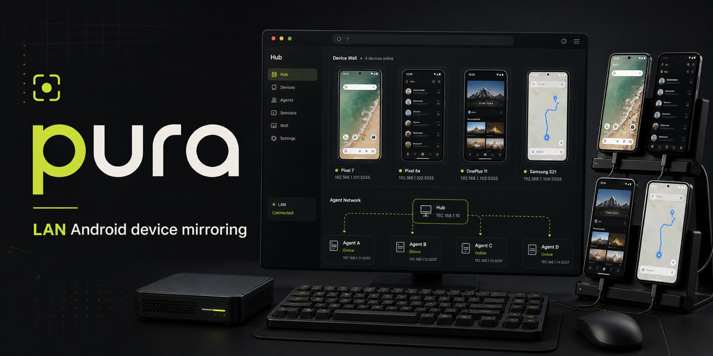
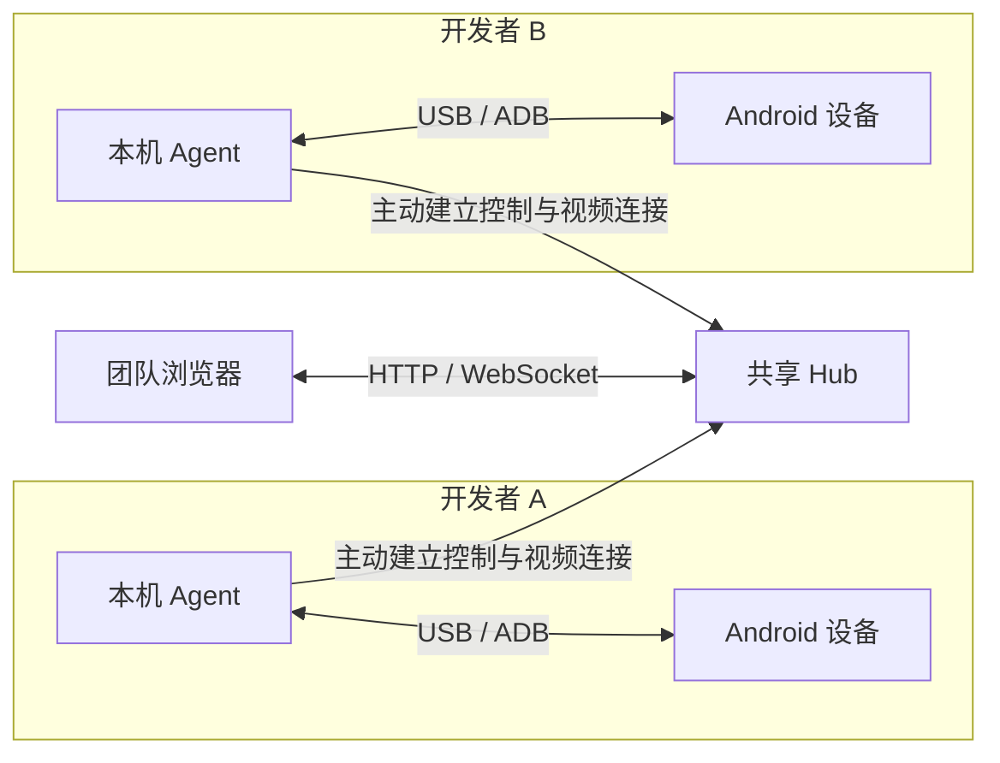

<h1 align="center">pura</h1>

<p align="center">
  <strong>团队的 Android 真机，同一个协作工作台。</strong><br />
  在局域网浏览器里查看、操作和评审真实设备。
</p>

<p align="center">
  <a href="https://www.npmjs.com/package/@nickname4th/pura-cli"></a>
  <a href="package.json"></a>
  <a href="LICENSE"></a>
</p>

<p align="center">
  <a href="https://liutianjie.github.io/pura/">官网</a> ·
  <a href="#快速开始">快速开始</a> ·
  <a href="#工作原理">架构</a> ·
  <a href="CONTRIBUTING.md">参与贡献</a> ·
  <a href="README.md">English</a>
</p>

<p align="center">
  <br />
  <sub>Hub 与 Agent 协作方式的产品示意图。</sub>
</p>

pura 把同事桌上的手机带到同一个浏览器工作台。设备继续连接在各自的开发电脑上，产品、设计和测试打开 Hub，就能查看实时画面、复现交互，一起记录反馈。

轻量 **Agent** 负责本机 ADB 连接，中心 **Hub** 提供界面，并通过 Agent 主动建立的连接转发视频与指令。Hub 可以运行在 Docker 中，无需反向连接每一台开发电脑。

> **面向可信局域网。** Hub 和 Agent API 默认没有身份认证，能够访问这些接口的人可能可以查看和控制已连接设备。请将两者放在可信网络边界内；发布设备用于组织共享列表，不是授权规则。详见[安全模型](SECURITY.md)。

## 从接入设备到共同评审

| 阶段 | pura 提供的能力 |
| --- | --- |
| **接入** | 通过开发者本机 ADB 发现已授权的 Android 设备 |
| **发布** | 为设备设置名称、负责人和备注，加入共享设备列表 |
| **查看** | 打开实时画面，查看其他观看者，并在评审时共享光标 |
| **操作** | 通过 ADB 点击、长按、滑动、滚动、发送系统按键和输入文字 |
| **排查** | 读取筛选后的 logcat 快照、安装已上传 APK，或打开 Deeplink |
| **记录** | 保存带圈画、框选标注的截图，再复制或下载 |
| **讨论** | 按需将截图和备注追加到每台设备绑定的飞书 / Lark 文档 |

Web 界面支持中英文。基础镜像无需云端账号、Android 配套 App 或 Root。可选的文档集成仅在启用并使用时访问飞书 / Lark。

## 快速开始

### 1. 启动 Hub

选择一台团队能够访问、已安装 Docker 和 Docker Compose 的机器：

```bash
git clone https://github.com/LiuTianjie/pura.git
cd pura
docker compose up -d --build
```

这条命令会明确构建当前检出的源码。使用现代浏览器打开 `http://<hub-lan-ip>:8787`。Hub 本身不需要通过 USB 连接手机。

<details>
<summary>使用已发布镜像</summary>

在仓库目录中拉取默认的 `ghcr.io/liutianjie/pura:main`，然后跳过本地构建启动：

```bash
docker compose pull
docker compose up -d --no-build
```

`main` 镜像提供 `linux/amd64` 与 `linux/arm64`。可通过 `PURA_IMAGE` 覆盖 Compose 中的镜像引用；需要可复现部署时，使用固定 Tag 或 Digest。

</details>

### 2. 接入开发电脑

在连接手机的电脑上安装 **Node.js 20+** 与 **Android SDK Platform-Tools**。打开手机的 USB 调试，并授权这台电脑的调试密钥。

确认 ADB 将设备报告为 `device`，然后连接 Agent：

```bash
adb devices -l
npx @nickname4th/pura-cli connect 192.168.1.10:8787 --name "Alex"
```

将 `192.168.1.10:8787` 换成实际 Hub 地址，并保持该进程运行。Agent 会报告本机设备，并主动连接 Hub 的控制与视频通道。

### 3. 发布并评审

打开 Hub，在设备管理中找到已连接的设备并发布。填写负责人，以及正在评审的构建版本或分支等备注。团队成员随后即可从共享列表打开设备。

每位开发者运行自己的 Agent。新电脑按相同流程接入，Hub 会统一展示它们连接的设备。

## macOS 后台运行

需要长期运行时，先全局安装 CLI，为后台服务提供稳定的可执行文件路径：

```bash
npm install -g @nickname4th/pura-cli
pura-cli connect 192.168.1.10:8787 --name "Alex" --background
```

命令会安装 macOS LaunchAgent，在登录时启动，并在终端关闭后继续维持 Agent 进程。查看或移除后台服务：

```bash
pura-cli auto-connect --status
pura-cli auto-connect --uninstall
```

内置后台安装目前**仅支持 macOS**。其他平台可保持前台进程运行，或使用自己的进程管理工具。断网恢复仍依赖电脑保持唤醒、Agent 持续运行，以及 ADB 能够访问手机。

<details>
<summary>通过 CLI 发布设备</summary>

本地 Agent 已经运行时：

```bash
pura-cli devices
pura-cli connect device --name "Review phone" --owner "Alex" --note "login branch"
```

连接多台手机时，明确指定序列号：

```bash
pura-cli connect device --serial YOUR_ADB_SERIAL --name "Review phone" --owner "Alex"
```

`pura-cli auto-connect` 使用已保存配置重新连接。`--public-url` 可以覆盖用于诊断的 Agent 公告地址，正常 Hub 转发流程不需要配置它。

</details>

## 工作原理



连接由 Agent 主动发起，建立后的控制通道可以双向传递请求和响应。画面经过**手机 → Agent → Hub → 浏览器**，输入指令则沿中继路径返回本地 ADB。

| 组件 | 职责 |
| --- | --- |
| **Hub** | 汇总设备、提供浏览器界面、转发会话、保存截图与 APK、维护文档绑定 |
| **Agent** | 本机设备发现、设备信息、发布记录、画面采集、ADB 输入与设备操作 |
| **浏览器** | 视频播放、观看者状态、共享光标、标注与评审操作 |

当前画面链路使用 Android `screenrecord` 输出原始 H.264，经 WebSocket 传输，并由浏览器端 JMuxer 播放，暂不传输音频。不同 Android 设备的采集行为存在差异；达到设备录制时限后，流重启可能短暂打断画面。仍有观看者时，Agent 会自动重启已退出的录制进程。

文本输入使用 `adb shell input text`，字符支持取决于 Android 的输入实现。iPhone 接入仍是[设计提案](docs/ios-support.md)，尚未成为已发布能力。

## 部署与数据保留

Compose 将命名卷 **`pura-data`** 挂载到 `/data`。升级时应保留它，其中存放截图、标注图片、已上传 APK 和每台设备的文档绑定。设备发布记录保存在对应的 Agent 上。

| 位置 | 内容 |
| --- | --- |
| Hub `DATA_DIR` | 截图及索引、APK 及索引、文档绑定 |
| `~/.pura/config.json` | CLI 连接配置与 Agent 身份 |
| `~/.pura/agent-data` | CLI 启动 Agent 时默认使用的持久化目录 |
| `~/Library/Logs/pura-agent.log` | macOS 后台 Agent 输出；错误日志为 `pura-agent.err.log` |

源码构建的 Hub 升级时，先获取目标版本，再执行 `docker compose up -d --build`。使用已发布镜像时，先执行 `docker compose pull`，再执行 `docker compose up -d --no-build`。`main` 是会随发布变化的标签。

Hub 也可以直接通过 Node.js 运行：

```bash
npm install -g @nickname4th/pura-cli
DATA_DIR=data-hub pura-cli hub --host 0.0.0.0 --port 8787
```

常用诊断命令：

```bash
curl http://127.0.0.1:8787/api/health
docker compose logs --tail=100 pura-hub
```

设备缺失时，先在设备所属电脑上检查 `adb devices -l`，再检查 Agent 进程和 Hub 连接。列表有设备但控制离线时，应检查控制通道；出现在设备列表中并不代表操作会话已经可用。

## 可选飞书 / Lark 文档

在设备控制侧栏绑定已有 Docx 文档，或创建一份新文档。截图操作可以追加时间、设备名、备注与保存的图片；绑定的文档也可以在侧边抽屉中打开。

在 `docker-compose.yml` 的 Hub 服务 `environment` 下加入以下字段，凭据值通过 shell 或私有 `.env` 文件提供：

```yaml
PURA_FEATURE_LARK_DOCS: "true"
LARK_APP_ID: ${LARK_APP_ID}
LARK_APP_SECRET: ${LARK_APP_SECRET}
```

可选的 `LARK_DOC_FOLDER_TOKEN` 用于指定新文档的默认文件夹。飞书应用需要文档创建 / 编辑权限及 `docs:document.media:upload`；绑定 Wiki 链接还需要 `wiki:wiki:readonly` 等节点读取权限。请向应用授予目标文档、文件夹或 Wiki 节点的访问权。

该功能**默认关闭**，凭据缺失时会禁用创建和写入入口。凭据保存在 Hub 侧；使用集成时，文档内容和截图媒体会发送到飞书 / Lark。Hub 上的绑定记录不是远程文档的本地副本。

## 配置参考

普通接入可使用 CLI 参数，服务端运行环境通过以下变量配置：

| 变量 | 默认值 / 含义 |
| --- | --- |
| `ROLE` | `standalone`；分布式运行使用 `hub` 或 `agent` |
| `HOST` | `0.0.0.0` |
| `PORT` | 服务端默认 `8787`；CLI 默认在 `8788` 启动 Agent，可覆盖 |
| `HUB_URL` | Agent 连接的 Hub 地址 |
| `AGENT_ID`、`AGENT_NAME` | 稳定 Agent 身份与显示名称 |
| `DATA_DIR` | 服务端默认 `data`；CLI / Compose 使用上文说明的位置 |
| `ADB_PATH` | 可选的 ADB 可执行文件路径 |
| `STREAM_SIZE` | 未设置时按设备原生分辨率采集 |
| `STREAM_BITRATE` | `8000000` bits/s |
| `STREAM_TIME_LIMIT_SECONDS` | `180`，仍受设备 `screenrecord` 行为约束 |
| `INCLUDE_TCP_DEVICES` | 设为 `true` 时包含已连接的 ADB-over-TCP 设备，默认仅 USB |
| `PUBLIC_URL` | 用于诊断的可选 Agent 公告地址，正常转发不使用它 |
| `PURA_FEATURE_LARK_DOCS` | 设为 `true` 启用文档集成 |
| `LARK_APP_ID`、`LARK_APP_SECRET` | Hub 侧集成凭据 |
| `LARK_DOC_FOLDER_TOKEN` | 可选的默认文档文件夹 |
| `LARK_OPEN_BASE_URL` | `https://open.feishu.cn` |
| `LARK_DOC_BASE_URL` | `https://www.feishu.cn`，用于生成文档链接 |

<details>
<summary>API 入口</summary>

Hub 路由使用 Hub 设备 ID，直连 Agent 路由使用 ADB 序列号，两者不是同一个标识。

| 接口 | 用途 |
| --- | --- |
| `GET /api/health` | 进程健康与运行角色 |
| `GET /api/devices` | 设备列表 |
| `POST /api/devices/:deviceId/session` | 创建或复用镜像会话 |
| `PUT /api/devices/:deviceId/publication` | 发布设备或更新描述信息 |
| `DELETE /api/devices/:deviceId/publication` | 取消发布 |
| `POST /api/devices/:deviceId/tap` | 点击 |
| `POST /api/devices/:deviceId/control` | 支持的按键或文本输入操作 |
| `POST /api/devices/:deviceId/logs` | 读取筛选后的 logcat 快照 |
| `POST /api/devices/:deviceId/deeplink` | 打开 Android Deeplink |
| `GET /api/packages`、`POST /api/packages` | 查看或上传 APK |
| `POST /api/devices/:deviceId/packages/:packageId/install` | 将已保存 APK 安装到设备 |
| `POST /api/devices/:deviceId/screenshots` | 捕获并保存截图 |
| `DELETE /api/sessions/:id` | 结束镜像会话 |
| `WS /ws/sessions/:id/video` | 接收 H.264 流 |

请求体，以及其余截图、标注、文档和 Agent 转发接口，以 [Hub 路由](server/src/hub.ts)、[Agent 路由](server/src/agent.ts)和 [WebSocket 分发](server/src/index.ts)中的定义为准。

</details>

## 开发与贡献

项目使用 TypeScript、React、Vite、Express 和 `ws`，CI 使用 Node.js 22 构建。

```bash
npm ci
npm run dev
```

开发界面运行在 `5173`，将 API / WebSocket 请求代理到 `8787`。`npm run dev` 默认以 standalone 角色启动服务端。需要在本机模拟分布式部署时，在不同终端运行 `npm run dev:hub`、`npm run dev:agent`，再通过 `npm run dev:client` 启动界面。

提交代码改动前：

```bash
npm run check
npm run build
npm pack --dry-run
```

| 路径 | 职责 |
| --- | --- |
| `client/src/` | 设备列表、实时画面、控制、标注与协作界面 |
| `server/src/cli.ts` | CLI 配置、保存连接与 macOS LaunchAgent 管理 |
| `server/src/hub.ts`、`server/src/agent.ts` | Hub 中继与本机设备操作 |
| `server/src/sessions.ts`、`server/src/adb.ts` | 视频会话、ADB 采集与输入 |
| `server/src/screenshots.ts`、`server/src/packages.ts` | 截图和 APK 存储 |
| `server/src/discussion-docs.ts` | 可选飞书 / Lark 文档集成 |
| `site/` | 项目官网 |

Pull Request 与发布流程见 [CONTRIBUTING.md](CONTRIBUTING.md)。反馈问题时，请附上 CLI / Hub 版本、主机系统、Android 机型与版本、ADB 状态及最小复现。公开日志前移除私人截图、设备序列号、应用日志和凭据。设备行为需要真机验证，类型检查与构建不能替代它。

## 安全与许可证

网络边界就是访问边界。请部署在可信团队局域网或同等受限网络中，不要直接向公网开放 Hub 或 Agent 端口。显示名称和设备负责人只是描述信息，并非经过认证的身份。漏洞披露方式见 [SECURITY.md](SECURITY.md)。

pura 使用 [MIT License](LICENSE) 发布。
